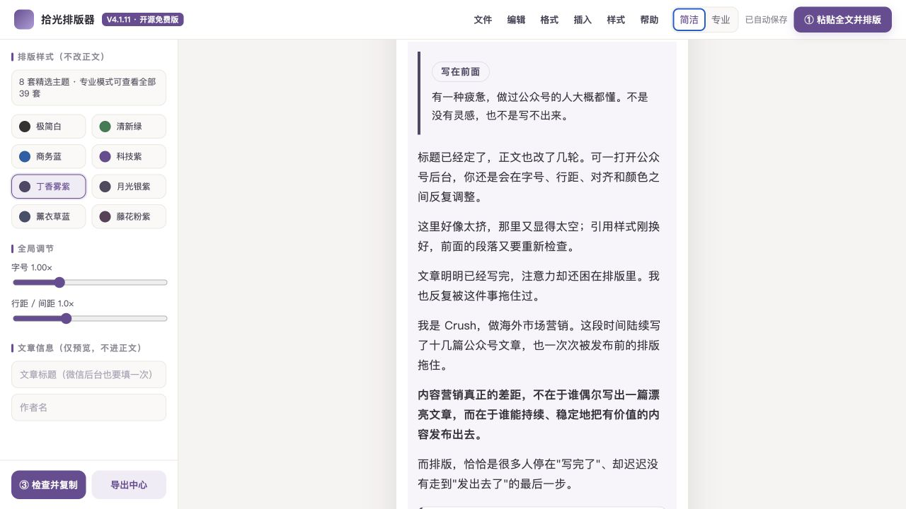

<div align="center">

# 拾光排版器

**无需注册、文章不上传的微信公众号排版工具**  
*A local-first WeChat Official Account typesetter*

[在线使用](https://xiangxiuchen.github.io/shiguang-wechat-typesetter/app/) · [下载免费 ZIP](https://github.com/xiangxiuchen/shiguang-wechat-typesetter/releases/latest/download/shiguang-wechat-typesetter-free.zip) · [3 分钟上手](QUICKSTART.md) · [English](README_EN.md)

35 套主题 · 16 套文章结构 · 33 个区块 · 单 HTML 双击即用

</div>



拾光排版器把公众号写作里反复调整字号、间距、配色和组件的工作，整理成一个本地单文件工具。你可以在线使用，也可以下载 HTML 后离线打开；文章默认保存在当前浏览器，不需要注册账号。

## 立即使用

- **在线体验：** [打开拾光排版器](https://xiangxiuchen.github.io/shiguang-wechat-typesetter/app/)
- **离线使用：** [下载固定最新 ZIP](https://github.com/xiangxiuchen/shiguang-wechat-typesetter/releases/latest/download/shiguang-wechat-typesetter-free.zip)
- **单 HTML：** [下载固定最新 HTML](https://github.com/xiangxiuchen/shiguang-wechat-typesetter/releases/latest/download/shiguang-wechat-typesetter-latest.html)
- **示例项目：** [下载可导入示例](examples/shiguang-launch-example.json)

## 3 分钟上手

1. 在线打开，或下载 HTML 后双击打开。
2. 复制整篇文章或选择 `.md` 文件，点击“一键排版文章”；默认替换旧示例，自动识别普通正文、代码、公式、链接、图片和表格，并在没有品牌文末时补上通用落尾。
3. 按需切换“排版样式（不改正文）”，再运行发布预检并复制清洁富文本到微信公众号后台。

正式发布前仍请完成：**粘贴 → 保存草稿 → 重新打开 → 手机预览**。图片需要在微信公众号后台上传，标题、摘要和封面也需要在后台填写。

更完整的第一次使用说明见 [3 分钟上手](QUICKSTART.md)，兼容边界见 [已知问题](KNOWN_ISSUES.md)。

## 为什么做成单 HTML

- **本地优先：** 不需要账号系统，正文不会被拾光上传到服务器。
- **打开简单：** 下载后双击即可使用，不依赖安装程序。
- **整篇一键排版：** 默认替换上次草稿，自动整理原文结构并匹配适合的视觉样式；没有品牌文末时自动补上通用落尾，不改写句子，生成后可撤销。
- **技术内容不再静默丢失：** 围栏代码逐字符保留；公式保留 LaTeX 并进入公式图片清单；Markdown 图片和链接进入可核对资产清单。
- **容易备份：** 支持本地草稿、快照和项目 JSON 导入导出。
- **发布更稳：** 编辑预览和微信发布输出分开，复制前经过专用清洁与预检。
- **同一地址持续更新：** 在线版地址不变；离线版可点击左上角版本号检查新版，但不会自动覆盖本地文件。

## 微信兼容边界

拾光会尽量把组件转换为更适合微信公众号的单列、内联样式结构，并对图片、公式、链接、真实表格和视觉降级作出提示。代码会转成微信安全的等宽卡片；块公式不会伪装成“已兼容”，而是保留 LaTeX 并在发布前要求转成图片。但微信公众号可能调整编辑器清洗规则，因此本地预检不等于微信官方认证。

当前验收标准是：

```text
复制清洁富文本
→ 粘贴到微信公众号后台
→ 保存草稿
→ 退出并重新打开
→ 手机预览确认
```

## 隐私

核心排版可以断网使用，文章和草稿保存在你自己的浏览器中。V4.1.6 起，联网时每 24 小时最多读取一次公开版本号，请求不包含正文、标题或草稿；失败时不影响编辑。GitHub Pages 页面和版本请求的基础访问数据适用 GitHub 的隐私规则。详细说明见 [PRIVACY.md](PRIVACY.md)。

## 反馈与支持

- 可复现问题：[提交兼容问题](https://github.com/xiangxiuchen/shiguang-wechat-typesetter/issues/new?template=bug.yml)
- 功能建议：[提交功能建议](https://github.com/xiangxiuchen/shiguang-wechat-typesetter/issues/new?template=feature.yml)
- 主题建议：[提交主题建议](https://github.com/xiangxiuchen/shiguang-wechat-typesetter/issues/new?template=theme.yml)

提交问题时请只使用脱敏内容，不要公开未发布文章、微信后台截图、客户信息、密码、验证码或恢复码。免费版不提供逐篇代排、远程操作或一对一教学，详见 [SUPPORT.md](SUPPORT.md)。

## 开源与署名

拾光排版器免费版采用 [Mozilla Public License 2.0](LICENSE) 开源。

Created and maintained by **Crush / [xiangxiuchen](https://github.com/xiangxiuchen)**。  
微信公众号：**Crush带你玩转海外市场营销**。

免费版无需关注即可完整使用。想收到微信兼容更新、主题上新和后续免费小工具，可在公众号回复 **「GitHub拾光」**。

> 公众号名称和作者署名不会被自动插入你复制出去的文章正文。

## 项目状态

- 当前公开版本：`V4.1.7`
- 微信发布渲染器：`4.3.0-markdown-tech-1`
- 维护状态：持续维护
- 更新记录：[CHANGELOG.md](CHANGELOG.md)
